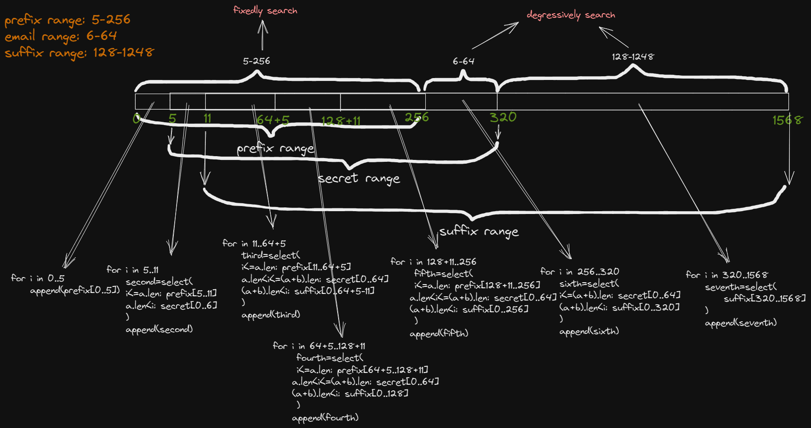

# substring-zkp
Prove that *Preimage1*(private) of one hash, and (prefix + *Preimage1* + suffix)(string concat, no padding) is another signed hash preimage.

## Circuit String Synthesis Design
In order to be compatible with Google signatures and maximize performance, the preimage of the signature hash is split into seven parts and then synthesized, as shown in the following figure:
